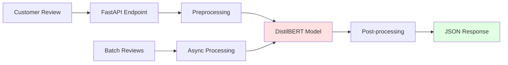
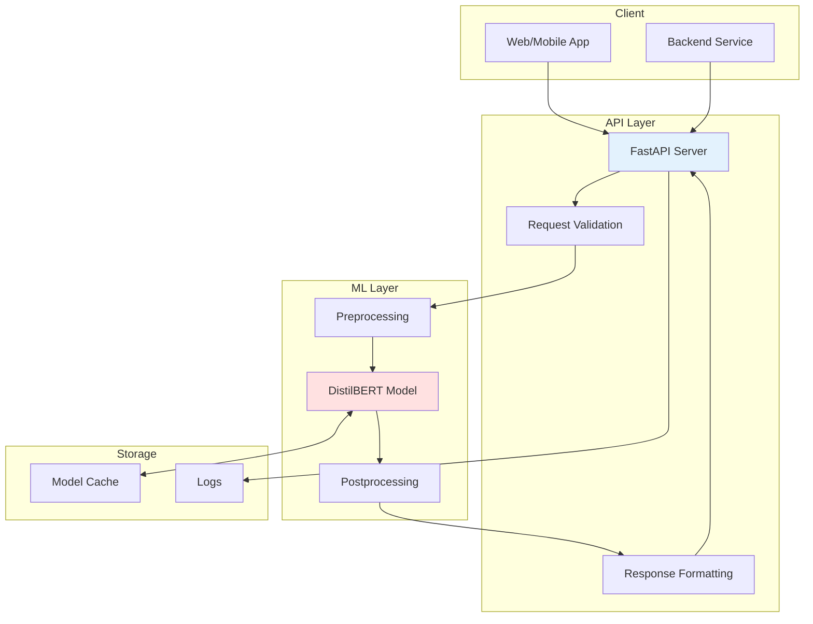

# 🎭 Customer Sentiment Analysis API

> Production-ready sentiment analysis API powered by fine-tuned DistilBERT. Analyze customer reviews at scale with 90%+ accuracy.

[](https://huggingface.co/IberaSoft/customer-sentiment-analyzer)
[](https://huggingface.co/datasets/IberaSoft/ecommerce-reviews-sentiment)
[](https://huggingface.co/spaces/IberaSoft/sentiment-analyzer-demo)
[](https://www.python.org/downloads/)
[](https://fastapi.tiangolo.com/)
[](LICENSE)


## 🎯 What I learned with this project:

- ✅ **HuggingFace Expertise**: Model fine-tuning, dataset creation, model hub publishing
- ✅ **Transformer Models**: Fine-tuning DistilBERT for domain-specific tasks
- ✅ **Production ML**: Model optimization, API deployment, monitoring
- ✅ **MLOps**: Training pipelines, model versioning, A/B testing setup
- ✅ **API Development**: FastAPI with async support, batch processing
- ✅ **Documentation**: Comprehensive model cards, API docs, deployment guides

## 🌟 Features


### API Capabilities
- 🚀 **Fast Inference**: < 50ms response time
- 📊 **Batch Processing**: Handle multiple reviews efficiently
- 🎯 **High Accuracy**: 90.2% on test set
- 📈 **Confidence Scores**: Get prediction confidence
- 🔄 **Async Support**: Non-blocking requests
- 📝 **Comprehensive Logging**: Track all predictions
- 🐳 **Docker Ready**: One-command deployment

### Model Features
- ⚡ **Optimized**: Quantized version available (4x smaller)
- 🌍 **Public**: Published on HuggingFace Hub
- 📚 **Well-Documented**: Complete model card
- 🧪 **Tested**: 90+ unit and integration tests
- 🔧 **Flexible**: Easy to fine-tune on your data

## 🚀 Quick Start

### Try the Live Demo

**🎮 Interactive Demo**: [HuggingFace Spaces](https://huggingface.co/spaces/IberaSoft/sentiment-analyzer-demo)

### Use the API

**Option 1: Docker (Recommended)**
```bash
# Pull and run
docker pull IberaSoft/sentiment-api:latest
docker run -p 8000:8000 IberaSoft/sentiment-api:latest

# Or build from source
git clone https://github.com/IberaSoft/sentiment-analysis-api.git
cd sentiment-analysis-api
docker-compose up -d

# Test
curl -X POST "http://localhost:8000/api/v1/predict" \
  -H "Content-Type: application/json" \
  -d '{"text": "This product is amazing!"}'
```

**Option 2: Local Installation**
```bash
# Clone repository
git clone https://github.com/IberaSoft/sentiment-analysis-api.git
cd sentiment-analysis-api

# Install dependencies
pip install -r requirements.txt

# Run API
uvicorn app.main:app --reload --port 8000

# Visit http://localhost:8000/docs for interactive API docs
```

### Use the Model Directly
```python
from transformers import pipeline

# Load model
classifier = pipeline(
    "sentiment-analysis",
    model="IberaSoft/customer-sentiment-analyzer"
)

# Analyze sentiment
result = classifier("This product exceeded my expectations!")
print(result)
# [{'label': 'positive', 'score': 0.9823}]
```

## 📡 API Documentation

### Base URL
```
http://localhost:8000/api/v1
```

### Endpoints

#### 1. Single Prediction
```bash
POST /predict
```

**Request**:
```json
{
  "text": "Great product, highly recommend!"
}
```

**Response**:
```json
{
  "sentiment": "positive",
  "confidence": 0.94,
  "scores": {
    "positive": 0.94,
    "negative": 0.03,
    "neutral": 0.03
  },
  "processing_time_ms": 35
}
```

#### 2. Batch Prediction
```bash
POST /predict/batch
```

**Request**:
```json
{
  "texts": [
    "Excellent service!",
    "Terrible experience.",
    "It's okay, nothing special."
  ]
}
```

**Response**:
```json
{
  "predictions": [
    {"text": "Excellent service!", "sentiment": "positive", "confidence": 0.96},
    {"text": "Terrible experience.", "sentiment": "negative", "confidence": 0.91},
    {"text": "It's okay, nothing special.", "sentiment": "neutral", "confidence": 0.78}
  ],
  "total_processed": 3,
  "avg_confidence": 0.88,
  "processing_time_ms": 87
}
```

#### 3. Model Info
```bash
GET /model/info
```

**Response**:
```json
{
  "model_name": "customer-sentiment-analyzer",
  "version": "1.0.0",
  "base_model": "distilbert-base-uncased",
  "classes": ["positive", "negative", "neutral"],
  "accuracy": 0.902,
  "f1_score": 0.89
}
```

#### 4. Health Check
```bash
GET /health
```

**Response**:
```json
{
  "status": "healthy",
  "model_loaded": true,
  "uptime_seconds": 3600
}
```

### Interactive API Docs

Visit **http://localhost:8000/docs** for Swagger UI with live testing.

## 📊 Model Performance

### Metrics

| Metric | Score |
|--------|-------|
| **Accuracy** | 90.2% |
| **F1 Score** | 0.89 |
| **Precision** | 0.90 |
| **Recall** | 0.89 |
| **Inference Time** | 35ms (CPU) |

### Confusion Matrix
```
                Predicted
              Pos  Neu  Neg
Actual Pos  [ 728   45   27 ]
       Neu  [  38  430   32 ]
       Neg  [  22   48  630 ]
```

### Benchmark Results

| Batch Size | Throughput (req/s) | Latency P95 (ms) |
|------------|-------------------|------------------|
| 1 | 28 | 45 |
| 8 | 89 | 120 |
| 32 | 156 | 280 |

*Tested on Intel i7-11700K*

## 🏗️ Architecture

## 🛠️ Tech Stack

| Component | Technology | Purpose |
|-----------|-----------|---------|
| **ML Framework** | HuggingFace Transformers | Model training & inference |
| **Base Model** | DistilBERT | Pre-trained transformer |
| **API Framework** | FastAPI | REST API server |
| **Web Server** | Uvicorn | ASGI server |
| **Validation** | Pydantic | Request/response validation |
| **Testing** | Pytest | Unit & integration tests |
| **Load Testing** | Locust | Performance testing |
| **Containerization** | Docker | Deployment |
| **CI/CD** | GitHub Actions | Automated testing & deployment |
| **Monitoring** | Prometheus | Metrics collection |

## 📁 Project Structure

```
sentiment-analysis-api/
├── app/
│   ├── main.py                  # FastAPI application
│   ├── config.py                # Configuration
│   ├── api/
│   │   └── endpoints/
│   │       ├── predict.py       # Prediction endpoints
│   │       ├── batch.py         # Batch processing
│   │       └── health.py        # Health checks
│   ├── core/
│   │   ├── model.py             # Model loading & inference
│   │   ├── preprocessing.py     # Text preprocessing
│   │   └── cache.py             # Response caching
│   ├── schemas/
│   │   ├── request.py           # Request models
│   │   └── response.py          # Response models
│   └── utils/
│       ├── logger.py            # Logging configuration
│       └── metrics.py           # Prometheus metrics
│
├── training/
│   ├── prepare_dataset.py       # Dataset preparation
│   ├── train.py                 # Model training
│   ├── evaluate.py              # Model evaluation
│   ├── optimize.py              # Model optimization
│   └── configs/
│       └── training_config.yaml
│
├── tests/
│   ├── unit/
│   │   ├── test_preprocessing.py
│   │   ├── test_model.py
│   │   └── test_api.py
│   ├── integration/
│   │   └── test_end_to_end.py
│   └── load/
│       └── locustfile.py
│
├── scripts/
│   ├── download_data.py
│   ├── upload_to_hf.py
│   └── benchmark.py
│
├── notebooks/
│   ├── 01_data_exploration.ipynb
│   ├── 02_model_training.ipynb
│   └── 03_error_analysis.ipynb
│
├── docs/
│   ├── API.md
│   ├── TRAINING.md
│   ├── DEPLOYMENT.md
│   └── TROUBLESHOOTING.md
│
├── .github/
│   └── workflows/
│       ├── test.yml
│       └── deploy.yml
│
├── Dockerfile
├── docker-compose.yml
├── requirements.txt
├── requirements-dev.txt
├── .env.example
├── README.md
└── LICENSE
```

## 💻 Development

### Setup Development Environment
```bash
# Clone repository
git clone https://github.com/IberaSoft/sentiment-analysis-api.git
cd sentiment-analysis-api

# Create virtual environment
python -m venv venv
source venv/bin/activate  # Windows: venv\Scripts\activate

# Install dependencies
pip install -r requirements-dev.txt

# Set up pre-commit hooks
pre-commit install
```

### Training the Model
```bash
# 1. Prepare dataset
cd training
python prepare_dataset.py \
  --output-dir ./data \
  --train-size 15000 \
  --val-size 3000 \
  --test-size 2000

# 2. Train model
python train.py \
  --config configs/training_config.yaml \
  --output-dir ./models/customer-sentiment-v1

# 3. Evaluate model
python evaluate.py \
  --model-dir ./models/customer-sentiment-v1 \
  --test-data ./data/test.jsonl

# 4. Upload to HuggingFace
python ../scripts/upload_to_hf.py \
  --model-dir ./models/customer-sentiment-v1 \
  --repo-name IberaSoft/customer-sentiment-analyzer
```

### Running Tests
```bash
# Unit tests
pytest tests/unit/ -v

# Integration tests
pytest tests/integration/ -v

# All tests with coverage
pytest tests/ --cov=app --cov-report=html

# Load tests
locust -f tests/load/locustfile.py --host=http://localhost:8000
```

### Running Locally
```bash
# Start API
uvicorn app.main:app --reload --port 8000

# In another terminal, test
curl -X POST "http://localhost:8000/api/v1/predict" \
  -H "Content-Type: application/json" \
  -d '{"text": "Amazing product!"}'
```

## 🐳 Docker Deployment

### Build and Run
```bash
# Build image
docker build -t sentiment-api:latest .

# Run container
docker run -d \
  --name sentiment-api \
  -p 8000:8000 \
  -e MODEL_NAME=IberaSoft/customer-sentiment-analyzer \
  sentiment-api:latest

# Check logs
docker logs -f sentiment-api
```

### Docker Compose
```bash
# Start all services
docker-compose up -d

# View logs
docker-compose logs -f

# Stop services
docker-compose down
```

### Environment Variables
```bash
# Required
MODEL_NAME=IberaSoft/customer-sentiment-analyzer

# Optional
LOG_LEVEL=INFO                   # DEBUG, INFO, WARNING, ERROR
MAX_BATCH_SIZE=32                # Maximum batch size
CACHE_SIZE=1000                  # LRU cache size
WORKERS=2                        # Number of workers
```

## 🚀 Production Deployment

### Option 1: HuggingFace Spaces (Easiest)

See the live demo: [HuggingFace Spaces](https://huggingface.co/spaces/IberaSoft/sentiment-analyzer-demo)

**Setup**:
1. Fork this repository
2. Create a new Space on HuggingFace
3. Connect your GitHub repo
4. Space will auto-deploy!

### Option 2: Cloud VPS
```bash
# On your server (DigitalOcean, Linode, etc.)
git clone https://github.com/IberaSoft/sentiment-analysis-api.git
cd sentiment-analysis-api

# Start with Docker Compose
docker-compose up -d

# Setup nginx reverse proxy
sudo apt install nginx
sudo nano /etc/nginx/sites-available/sentiment-api

# Add configuration:
server {
    listen 80;
    server_name your-domain.com;
    
    location / {
        proxy_pass http://localhost:8000;
        proxy_set_header Host $host;
        proxy_set_header X-Real-IP $remote_addr;
    }
}

sudo ln -s /etc/nginx/sites-available/sentiment-api /etc/nginx/sites-enabled/
sudo systemctl restart nginx
```

### Option 3: AWS/GCP/Azure

See [DEPLOYMENT.md](docs/DEPLOYMENT.md) for detailed cloud deployment guides.

## 📈 Monitoring

### Prometheus Metrics

Available at `http://localhost:8000/metrics`

**Key Metrics**:
- `sentiment_predictions_total` - Total predictions by sentiment
- `inference_duration_seconds` - Inference latency histogram
- `api_requests_total` - Total API requests
- `api_errors_total` - Total API errors

### Logging

Logs are structured JSON for easy parsing:
```json
{
  "timestamp": "2026-01-15T10:30:45.123Z",
  "level": "INFO",
  "message": "Prediction made",
  "sentiment": "positive",
  "confidence": 0.94,
  "processing_time_ms": 35,
  "request_id": "abc123"
}
```

## 🔧 Customization

### Fine-tune on Your Data
```python
# 1. Prepare your dataset
from datasets import Dataset

data = {
    "text": ["your review 1", "your review 2", ...],
    "label": [2, 0, ...]  # 0=negative, 1=neutral, 2=positive
}

dataset = Dataset.from_dict(data)
dataset.push_to_hub("your-username/your-dataset")

# 2. Fine-tune
python training/train.py \
  --base-model IberaSoft/customer-sentiment-analyzer \
  --dataset your-username/your-dataset \
  --output-dir ./models/custom-model

# 3. Update API to use your model
# Edit app/config.py: MODEL_NAME = "your-username/custom-model"
```

### Add Custom Preprocessing
```python
# app/core/preprocessing.py

def custom_preprocess(text: str) -> str:
    """Add your custom preprocessing steps"""
    # Remove specific patterns
    text = re.sub(r'pattern', '', text)
    
    # Add domain-specific handling
    text = handle_domain_terms(text)
    
    return text
```

## 🐛 Troubleshooting

<details>
<summary><b>Model not loading</b></summary>

**Symptoms**: `Model not found` error

**Solutions**:
1. Check model name is correct in `.env`
2. Verify internet connection (model downloads from HuggingFace)
3. Check HuggingFace Hub status
4. Try downloading manually:
```python
from transformers import AutoModel
AutoModel.from_pretrained("IberaSoft/customer-sentiment-analyzer")
```
</details>

<details>
<summary><b>Slow inference</b></summary>

**Solutions**:
1. Use GPU if available (set `device=0` in config)
2. Enable quantization (see [optimize.py](training/optimize.py))
3. Batch requests together
4. Use ONNX runtime for 2-3x speedup
</details>

<details>
<summary><b>Out of memory errors</b></summary>

**Solutions**:
1. Reduce batch size in `.env`
2. Use quantized model
3. Increase Docker memory limits
4. Clear model cache periodically
</details>

See [TROUBLESHOOTING.md](docs/TROUBLESHOOTING.md) for more.

## 📚 Resources

### Documentation
- 📖 [API Reference](docs/API.md)
- 🎓 [Training Guide](docs/TRAINING.md)
- 🚀 [Deployment Guide](docs/DEPLOYMENT.md)
- 🔧 [Troubleshooting](docs/TROUBLESHOOTING.md)

### External Links
- 🤗 [HuggingFace Model](https://huggingface.co/IberaSoft/customer-sentiment-analyzer)
- 📊 [Dataset](https://huggingface.co/datasets/IberaSoft/ecommerce-reviews-sentiment)
- 🎮 [Live Demo](https://huggingface.co/spaces/IberaSoft/sentiment-analyzer-demo)
- 📝 [Blog Post](https://yourblog.com/sentiment-analysis-project)

## 🗺️ Roadmap

### v1.1 - Enhanced Features (Next)
- [ ] Multi-language support (Spanish, French, German)
- [ ] Aspect-based sentiment analysis
- [ ] Confidence calibration improvements
- [ ] Real-time model updates

### v1.2 - Performance (Planned)
- [ ] ONNX optimization
- [ ] Model distillation (smaller, faster)
- [ ] GPU batch processing
- [ ] Response streaming

### v2.0 - Advanced (Future)
- [ ] Multi-model ensemble
- [ ] Active learning pipeline
- [ ] A/B testing framework
- [ ] Explainability (SHAP, LIME)

### v3.0 - Enterprise (Future)
- [ ] Multi-tenancy support
- [ ] Custom model training UI
- [ ] Advanced analytics dashboard
- [ ] SLA monitoring

## 🤝 Contributing

Contributions welcome! See [CONTRIBUTING.md](CONTRIBUTING.md) for guidelines.

**Ways to contribute**:
- 🐛 Report bugs
- 💡 Suggest features
- 📝 Improve documentation
- 🧪 Add tests
- 🎨 Improve UI/UX

## 📝 License

This project is licensed under the MIT License - see [LICENSE](LICENSE) for details.

## 🙏 Acknowledgments

- **HuggingFace** for Transformers library and model hub
- **FastAPI** team for excellent framework
- **DistilBERT authors** for the efficient base model
- **Community** for feedback and contributions

**Project Links**:
- 🤗 [Model](https://huggingface.co/IberaSoft/customer-sentiment-analyzer)
- 📊 [Dataset](https://huggingface.co/datasets/IberaSoft/ecommerce-reviews-sentiment)
- 🎮 [Demo](https://huggingface.co/spaces/IberaSoft/sentiment-analyzer-demo)

---

<div align="center">

### ⭐ Star this repo if you find it useful!

**Built with ❤️ by an aspiring AI/ML Engineer**


**Try the live demo**: [HuggingFace Spaces](https://huggingface.co/spaces/IberaSoft/sentiment-analyzer-demo)

</div>
