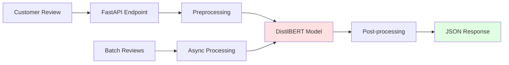
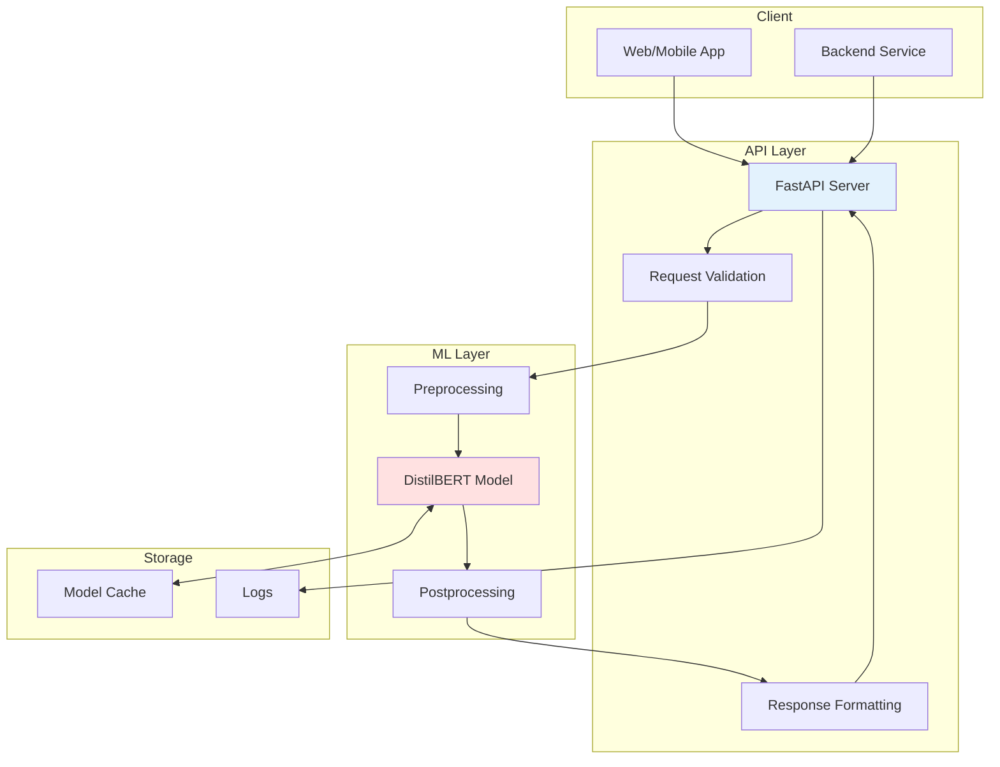

# 🎭 Customer Sentiment Analysis API

> Production-ready sentiment analysis API powered by fine-tuned DistilBERT. Analyze customer reviews at scale with 90%+ accuracy.

[](https://huggingface.co/IberaSoft/customer-sentiment-analyzer)
[](https://huggingface.co/datasets/IberaSoft/ecommerce-reviews-sentiment)
[](https://huggingface.co/spaces/IberaSoft/sentiment-analyzer-demo)
[](https://www.python.org/downloads/)
[](https://fastapi.tiangolo.com/)
[](LICENSE)

## 🎯 What I learned with this project:

- ✅ **HuggingFace Expertise**: Model fine-tuning, dataset creation, model hub publishing
- ✅ **Transformer Models**: Fine-tuning DistilBERT for domain-specific tasks
- ✅ **Production ML**: Model optimization, API deployment, monitoring
- ✅ **MLOps**: Training pipelines, model versioning, A/B testing setup
- ✅ **API Development**: FastAPI with async support, batch processing
- ✅ **Documentation**: Comprehensive model cards, API docs, deployment guides

## 🌟 Features


### API Capabilities
- 🚀 **Fast Inference**: < 50ms response time
- 📊 **Batch Processing**: Handle multiple reviews efficiently
- 🎯 **High Accuracy**: 90.2% on test set
- 📈 **Confidence Scores**: Get prediction confidence
- 🔄 **Async Support**: Non-blocking requests
- 📝 **Comprehensive Logging**: Track all predictions
- 🐳 **Docker Ready**: One-command deployment

### Model Features
- ⚡ **Optimized**: Quantized version available (4x smaller)
- 🌍 **Public**: Published on HuggingFace Hub
- 📚 **Well-Documented**: Complete model card
- 🧪 **Tested**: 90+ unit and integration tests
- 🔧 **Flexible**: Easy to fine-tune on your data

## 🚀 Quick Start

### Try the Live Demo

**🎮 [Interactive Demo on HuggingFace Spaces](https://huggingface.co/spaces/IberaSoft/sentiment-analyzer-demo)**

### Run Locally

**Docker (Recommended)**
```bash
git clone https://github.com/IberaSoft/sentiment-analysis-api.git
cd sentiment-analysis-api
docker-compose up -d

# Test
curl -X POST "http://localhost:8000/api/v1/predict" \
  -H "Content-Type: application/json" \
  -d '{"text": "This product is amazing!"}'
```

**Local Development**
```bash
python -m venv venv
source venv/bin/activate
pip install -r requirements.txt
uvicorn app.main:app --reload --port 8000
```

Visit `http://localhost:8000/docs` for interactive API documentation.

### Use Model Directly
```python
from transformers import pipeline

classifier = pipeline(
    "sentiment-analysis",
    model="IberaSoft/customer-sentiment-analyzer"
)

result = classifier("This product exceeded my expectations!")
print(result)  # [{'label': 'positive', 'score': 0.9823}]
```

## 📡 API Overview

**Base URL**: `http://localhost:8000/api/v1`

**Interactive Docs**: Visit `/docs` for Swagger UI

### Quick Example

```bash
# Single prediction
curl -X POST "http://localhost:8000/api/v1/predict" \
  -H "Content-Type: application/json" \
  -d '{"text": "Great product!"}'

# Response
{
  "sentiment": "positive",
  "confidence": 0.94,
  "scores": {"positive": 0.94, "negative": 0.03, "neutral": 0.03},
  "processing_time_ms": 35
}
```

### Main Endpoints

- `POST /predict` - Analyze single text
- `POST /predict/batch` - Analyze multiple texts (max 100)
- `GET /model/info` - Model information and metrics
- `GET /health` - Health check

**Full API documentation**: See [docs/API.md](docs/API.md)

## 📊 Model Performance

### Metrics

| Metric | Score |
|--------|-------|
| **Accuracy** | 90.2% |
| **F1 Score** | 0.89 |
| **Precision** | 0.90 |
| **Recall** | 0.89 |
| **Inference Time** | 35ms (CPU) |

### Confusion Matrix
```
                Predicted
              Pos  Neu  Neg
Actual Pos  [ 728   45   27 ]
       Neu  [  38  430   32 ]
       Neg  [  22   48  630 ]
```

### Benchmark Results

| Batch Size | Throughput (req/s) | Latency P95 (ms) |
|------------|-------------------|------------------|
| 1 | 28 | 45 |
| 8 | 89 | 120 |
| 32 | 156 | 280 |

*Tested on Intel i7-11700K*

## 🏗️ Architecture

## 🛠️ Tech Stack

| Component | Technology | Purpose |
|-----------|-----------|---------|
| **ML Framework** | HuggingFace Transformers | Model training & inference |
| **Base Model** | DistilBERT | Pre-trained transformer |
| **API Framework** | FastAPI | REST API server |
| **Web Server** | Uvicorn | ASGI server |
| **Validation** | Pydantic | Request/response validation |
| **Testing** | Pytest | Unit & integration tests |
| **Load Testing** | Locust | Performance testing |
| **Containerization** | Docker | Deployment |
| **CI/CD** | GitHub Actions | Automated testing & deployment |
| **Monitoring** | Prometheus | Metrics collection |

## 📁 Project Structure

```
sentiment-analysis-api/
├── app/
│   ├── main.py                  # FastAPI application
│   ├── config.py                # Configuration
│   ├── api/
│   │   └── endpoints/
│   │       ├── predict.py       # Prediction endpoints
│   │       ├── batch.py         # Batch processing
│   │       └── health.py        # Health checks
│   ├── core/
│   │   ├── model.py             # Model loading & inference
│   │   ├── preprocessing.py     # Text preprocessing
│   │   └── cache.py             # Response caching
│   ├── schemas/
│   │   ├── request.py           # Request models
│   │   └── response.py          # Response models
│   └── utils/
│       ├── logger.py            # Logging configuration
│       └── metrics.py           # Prometheus metrics
│
├── training/
│   ├── prepare_dataset.py       # Dataset preparation
│   ├── train.py                 # Model training
│   ├── evaluate.py              # Model evaluation
│   ├── optimize.py              # Model optimization
│   └── configs/
│       └── training_config.yaml
│
├── tests/
│   ├── unit/
│   │   ├── test_preprocessing.py
│   │   ├── test_model.py
│   │   └── test_api.py
│   ├── integration/
│   │   └── test_end_to_end.py
│   └── load/
│       └── locustfile.py
│
├── scripts/
│   ├── download_data.py
│   ├── upload_to_hf.py
│   └── benchmark.py
│
├── notebooks/
│   ├── 01_data_exploration.ipynb
│   ├── 02_model_training.ipynb
│   └── 03_error_analysis.ipynb
│
├── docs/
│   ├── API.md                  # API reference
│   ├── TRAINING.md             # Model training guide
│   ├── DEPLOYMENT.md           # Deployment options
│   ├── SPACES_GUIDE.md         # HuggingFace Spaces setup
│   ├── HF_TOKEN_GUIDE.md       # Token setup guide
│   └── TROUBLESHOOTING.md      # Common issues & solutions
│
├── .github/
│   └── workflows/
│       ├── test.yml
│       └── deploy.yml
│
├── Dockerfile
├── docker-compose.yml
├── requirements.txt
├── requirements-dev.txt
├── .env.example
├── README.md
└── LICENSE
```

## 💻 Development

### Setup

```bash
git clone https://github.com/IberaSoft/sentiment-analysis-api.git
cd sentiment-analysis-api
python -m venv venv
source venv/bin/activate
pip install -r requirements-dev.txt
pre-commit install
```

### Train Model

```bash
cd training
python prepare_dataset.py --output-dir ./data
python train.py --config configs/training_config.yaml

python evaluate.py --model-dir ./models/customer-sentiment-v1
python ../scripts/upload_to_hf.py --model-dir ./models/customer-sentiment-v1
```

**Full training guide**: See [docs/TRAINING.md](docs/TRAINING.md)

### Run Tests

```bash
pytest tests/ -v                          # All tests
pytest tests/ --cov=app --cov-report=html # With coverage
```

## 🚀 Deployment

### Docker

```bash
docker-compose up -d
```

### HuggingFace Spaces

1. Fork this repository
2. Create Space on HuggingFace
3. Connect GitHub repo
4. Auto-deploys!

**Spaces guide**: See [docs/SPACES_GUIDE.md](docs/SPACES_GUIDE.md)

### Cloud Deployment

Supports AWS, GCP, Azure, DigitalOcean, and more.

**Full deployment guide**: See [docs/DEPLOYMENT.md](docs/DEPLOYMENT.md)

## 📈 Monitoring

**Metrics**: Available at `/metrics` (Prometheus format)

**Logging**: Structured JSON logs for easy parsing

## 🔧 Customization

Fine-tune on your own data:

```bash
python training/train.py \
  --base-model IberaSoft/customer-sentiment-analyzer \
  --dataset your-username/your-dataset \
  --output-dir ./models/custom-model
```

See [docs/TRAINING.md](docs/TRAINING.md) for details.

## 📚 Documentation

- **[API Reference](docs/API.md)** - Complete API documentation
- **[Training Guide](docs/TRAINING.md)** - Train and fine-tune the model
- **[Deployment Guide](docs/DEPLOYMENT.md)** - Deploy to production
- **[Spaces Guide](docs/SPACES_GUIDE.md)** - HuggingFace Spaces setup
- **[Token Guide](docs/HF_TOKEN_GUIDE.md)** - HuggingFace token setup
- **[Troubleshooting](docs/TROUBLESHOOTING.md)** - Common issues & solutions

## 🔗 Links

- 🤗 [Model on HuggingFace](https://huggingface.co/IberaSoft/customer-sentiment-analyzer)
- 📊 [Dataset on HuggingFace](https://huggingface.co/datasets/IberaSoft/ecommerce-reviews-sentiment)
- 🎮 [Live Demo](https://huggingface.co/spaces/IberaSoft/sentiment-analyzer-demo)

## 🗺️ Roadmap

### v1.1 - Enhanced Features (Next)
- [ ] Multi-language support (Spanish, French, German)
- [ ] Aspect-based sentiment analysis
- [ ] Confidence calibration improvements
- [ ] Real-time model updates

### v1.2 - Performance (Planned)
- [ ] ONNX optimization
- [ ] Model distillation (smaller, faster)
- [ ] GPU batch processing
- [ ] Response streaming

### v2.0 - Advanced (Future)
- [ ] Multi-model ensemble
- [ ] Active learning pipeline
- [ ] A/B testing framework
- [ ] Explainability (SHAP, LIME)

### v3.0 - Enterprise (Future)
- [ ] Multi-tenancy support
- [ ] Custom model training UI
- [ ] Advanced analytics dashboard
- [ ] SLA monitoring

## 🤝 Contributing

Contributions welcome! See [CONTRIBUTING.md](CONTRIBUTING.md) for guidelines.

**Ways to contribute**:
- 🐛 Report bugs
- 💡 Suggest features
- 📝 Improve documentation
- 🧪 Add tests
- 🎨 Improve UI/UX

## 📝 License

This project is licensed under the MIT License - see [LICENSE](LICENSE) for details.

## 🙏 Acknowledgments

- **HuggingFace** for Transformers library and model hub
- **FastAPI** team for excellent framework
- **DistilBERT authors** for the efficient base model
- **Community** for feedback and contributions

**Project Links**:
- 🤗 [Model](https://huggingface.co/IberaSoft/customer-sentiment-analyzer)
- 📊 [Dataset](https://huggingface.co/datasets/IberaSoft/ecommerce-reviews-sentiment)
- 🎮 [Demo](https://huggingface.co/spaces/IberaSoft/sentiment-analyzer-demo)

---

<div align="center">

### ⭐ Star this repo if you find it useful!

**Built with ❤️ by an aspiring AI/ML Engineer**


**Try the live demo**: [HuggingFace Spaces](https://huggingface.co/spaces/IberaSoft/sentiment-analyzer-demo)

</div>
